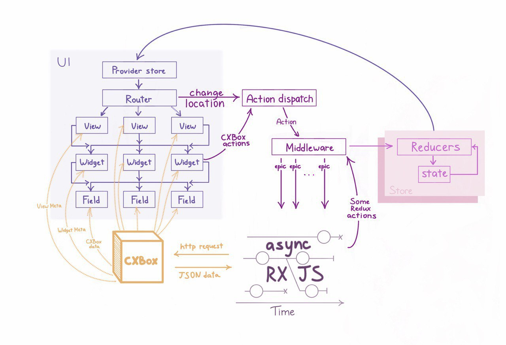
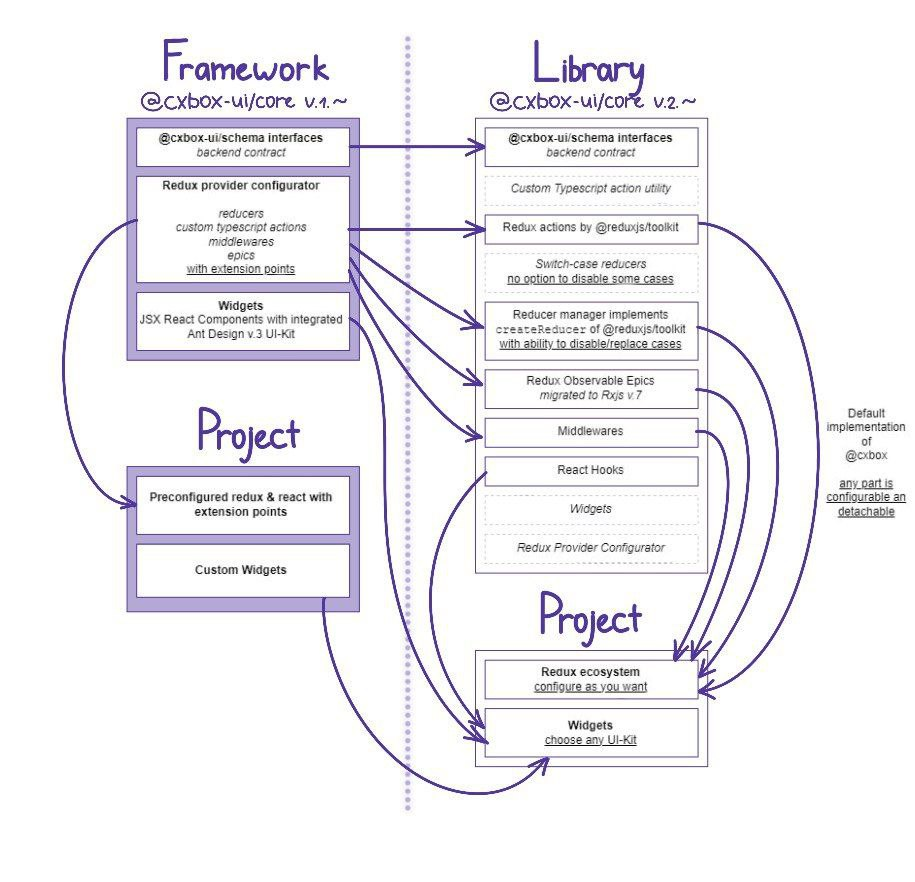

<h2 align="center">CXBOX UI</h2>

<div align="center">
<a href="https://github.com/CX-Box/cxbox-ui/actions/workflows/build.yml">
</a> 
<a href="https://sonarcloud.io/summary/overall?id=CX-Box_cxbox-ui">
</a>
</div>

<blockquote>
<div> 
<p align="center">
<h4 align="center">CXBOX - Rapid Enterprise Level Application Development Platform</h4>

<p align="center">
<a href="http://www.apache.org/licenses/LICENSE-2.0"></a>
</p>

<div align="center">
  <h3>
    <a href="https://cxbox.org/" target="_blank">
      Website
    </a>
    <span> | </span>
    <a href="http://demo.cxbox.org/" target="_blank">
      Demo
    </a>
    <span> | </span>
    <a href="https://doc.cxbox.org/" target="_blank">
      Documentation
    </a>
  </h3>

</div>


<h3>Description</h2>
<p>
CXBOX main purpose is to speed up development of typical Enterprise Level Application based on Spring Boot. A fixed
contract with a user interface called <a href="https://github.com/CX-Box/cxbox-ui" target="_blank">Cxbox-UI</a> allows backend developer to create
typical interfaces providing just Json meta files. Full set of typical Enterprise Level UI components included -
widgets, fields, layouts (views), navigation (screens).
</p>
</div>

<h3>Using CXBOX</h2>
<ul>
<li> <a href="https://plugins.jetbrains.com/plugin/19523-tesler-helper" target="_blank">download Intellij Plugin</a> adds platform specific autocomplete, inspection, navigation and code generation features.
</li>
<li>
 <a href="https://github.com/CX-Box/cxbox-demo" target="_blank">download Demo</a> and follow <a href="https://github.com/CX-Box/cxbox-demo#readme" target="_blank">README.md</a> instructions. Feel free to use demo as template project to start your own projects
</li>
</ul>
</blockquote>

# CXBOX UI

## Main concepts

**[@cxbox-ui/core](https://www.npmjs.com/package/@cxbox-ui/core)** is a typescript library that includes set of prebuilt pieces of Redux ecosystem, to correctly interact with CXBox framework. It contains all parts to combine Redux store inside of your React application.

- Actions
- Reducers
- Middlewares
- Epics
    - *RxJS methods for asynchronous interaction with CXBOX framework*
- Api
    - *Wrapped in RxJS observables*
- Utilities
- Interfaces
    - *CXBOX interaction typescript contract*



---

## Changelog



---

## Getting started

The best way to start CXBox project is to clone [CXBox-Demo](https://github.com/CX-Box/cxbox-demo) and follow the [README](https://github.com/CX-Box/cxbox-demo/blob/main/README.md) instructions

---

## Manual installation

**[@cxbox-ui/core](https://www.npmjs.com/package/@cxbox-ui/core)** distributed in form of ESM* npm package:
```bash
yarn add @cxbox-ui/core
```
or
```bash
npm install @cxbox-ui/core
```

Several libraries are specified as peer dependencies and should be installed
- react
- react-dom
- @reduxjs/toolkit
- rxjs
- redux-observable
- axios

> [!WARNING]
> CJS module system are no longer supported
---

## Usage

Library proposes to use common way of configuring your Redux store with some nuances

[How to configure default Redux store](https://redux-toolkit.js.org/tutorials/quick-start)

### Reducers
[Proper way of creating reducers](https://redux-toolkit.js.org/api/createReducer#usage-with-the-builder-callback-notation)

**@cxbox-ui/core** exports all arguments for **@reduxjs/toolkit** `createReducer` method, such as `initialState` and `createReducerBuilderManager` instances of default **_CXBox reducers_**

```ts
import {reducers} from '@cxbox-ui/core'
import {createReducer} from '@reduxjs/toolkit'

const viewReducerBuilder = reducers
    .createViewReducerBuilderManager(reducers.initialViewState)
    .builder

const viewReducer = createReducer(reducers.initialViewState, viewReducerBuilder)
```

`ReducerBuildManager` implements default methods of `createReducer` builder callback argument, with `removeCase` and `replaceCase`

```ts
const viewReducerBuilder = reducers
    .createViewReducerBuilderManager(reducers.initialViewState)
    .removeCase('sampleCXBoxAction')
    .addCase('anotherSampleAction', () => {/** do something with state */})
    .replaceCase('someCXBoxActionToo', () => {/** in case of CXBox realization is not satisfying */})
    .builder

const viewReducer = createReducer(reducers.initialViewState, viewReducerBuilder)
```

More appropriate case samples in [CXBox-Demo](https://github.com/CX-Box/cxbox-demo/tree/main/ui/src/reducers)

### Combine reducers

```ts
import {combineReducers, configureStore} from '@reduxjs/toolkit'

const rootReducer = combineReducers({
    screen: screenReducer,
    data: dataReducer,
    view: viewReducer,
    session: sessionReducer,
    router: routerReducer,
    notification: notificationReducer
})

const store = configureStore({
    reducers: rootReducer
})
```

### Redux-observable middleware

To make this store work with CXBox backend, you should configure asynchronous interaction by applying preconfigured [Redux-Observable](https://redux-observable.js.org/) **Epics**

It will take two steps
- Configure Api Axios instance

```ts
import {Api} from '@cxbox-ui/core'
import Axios from 'axios'

const __AJAX_TIMEOUT__ = 900000
const __CLIENT_ID__: number = Date.now()

const HEADERS = { Pragma: 'no-cache', 'Cache-Control': 'no-cache, no-store, must-revalidate' }

const instance = axios.create({
    baseURL: __API__,
    timeout: __AJAX_TIMEOUT__,
    responseType: 'json',
    headers: {
        ...HEADERS,
        ...{ ClientId: __CLIENT_ID__ }
    }
})

const CXBoxApiInstance = new Api(instance)
```

_You can also extend any of Api methods to use in your epics_

```ts
import {Api} from '@cxbox-ui/core'

class ExtendedApi extends Api {
    getSomethingUnusual(thing: string) {
        return this.$api.get(thing)
    }
}

const CXBoxApiInstance = new ExtendedApi(axiosInstance)
```

- [Setting up middleware](https://redux-observable.js.org/docs/basics/SettingUpTheMiddleware.html)

```ts
import {epics} from '@cxbox-ui/core'
import {combineEpics, createEpicMiddleware} from 'redux-observable'
import {configureStore, getDefaultMiddleware} from '@reduxjs/toolkit'

// Typescript cast if you changed default CXBoxEpic type
const coreEpics = {...epics} as unknown as Record<string, RootEpic>

const rootEpic = combineEpics(Object.values(coreEpics))

const epicMiddleware = createEpicMiddleware({
    dependencies: {
        api: CXBoxApiInstance
    }
})

const store = configureStore({
    reducer: rootReducer,
    middleware: getDefaultMiddleware().concat(epicMiddleware)
})

epicMiddleware.run(rootEpic)
```

### Epics

Feel free to add, but be careful to replace or remove some epics. They can call actions that causes chain effect, but if you sure in consequences, manipulate imported epics object as you want.

```ts
import {createAction} from '@reduxjs/toolkit'

const sampleAction = createAction<string>('sampleAction')

const sampleEpic: RootEpic = (action$, state$, {api}) =>
    action$.pipe(
        filter(sampleAction.match),
        switchMap(action => {
            const name = action.payload

            if (name) {
                api.doSomething(name)
            }

            return EMPTY
        }),
        catchError(error => {
            return utils.createApiErrorObservable(error)
        })
    )

const rootEpic = combineEpics(...Object.values(epics), sampleEpic)
```

### Middlewares 

@cxbox-ui/core also exports some middlewares, that not uses Redux-Observable way, but they still need to be applied

```ts
import {configureStore, getDefaultMiddleware} from '@reduxjs/toolkit'
import {middlewares} from '@cxbox-ui/core'

const store = configureStore({
    reducer: rootReducer,
    middleware: getDefaultMiddleware()
        .concat(...Object.values(middlewares))
        .concat(epicMiddleware)
})
```

---

## Widget example


```tsx
import React from 'react'
import { interfaces } from '@cxbox-ui/core'
import { useDispatch } from 'react-redux'
import { useAppSelector } from '@store'
import { actions } from '@cxbox-ui/core'
import InfoRow from './components/InfoRow'
import { Row } from 'antd'
import { useFlatFormFields } from '@hooks/useFlatFormFields'

interface FunnelProps {
    meta: FunnelWidgetMeta
}

function Funnel({ meta }: FunnelProps) {
    const { bcName } = meta
    const data = useAppSelector(state => state.data[bcName])
    const sortedData = data?.slice().sort(sorter)
    const funnelData = sortedData?.map(i => ({ id: i.funnelKey, value: i.amount }))
    const color = sortedData?.map(i => i.color) as Array<string>

    const legend: Types.LegendCfg = {
        position: 'right',
        layout: 'vertical',
        itemMarginBottom: 16,
        itemName: { style: { fontSize: 14, fontFamily: 'Roboto', fontWeight: 400 } },
        marker: (name, index) => ({
            symbol: 'circle',
            style: {
                fill: color[index]
            }
        })
    }
    const label: Label = {
        content: labelData => labelData.value,
        style: {
            fontSize: 20,
            fontFamily: 'Roboto',
            fontWeight: '700',
            fill: '#141F35'
        }
    }
    return (
        <div>
            <AntFunnel data={funnelData} xField="id" yField="value" color={color} conversionTag={false} legend={legend} label={label} />
        </div>
    )
}

function sorter(a: interfaces.DataItem, b: interfaces.DataItem) {
    return parseInt(b.amount as string) - parseInt(a.amount as string)
}

export default React.memo(Funnel)
```

# Contributing

All contributions are welcomed, as even a minor pull request with grammar fixes or a single documentation update is of a significant help for us!  
We promise to handle all PR reviews in a friendly and respectful manner.
